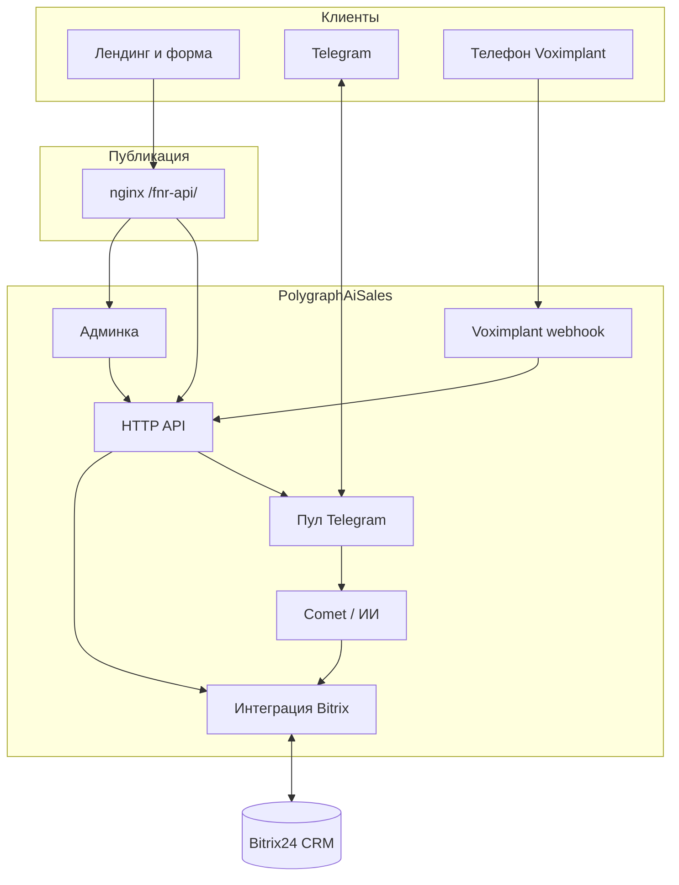

<div align="center">

# PolygraphAiSales

### Единая платформа продаж для Flex-n-roll PRO

*Сайт · Bitrix24 · Telegram · голос · ИИ — один контур, одна админка, полная прозрачность воронки.*

</div>

---

## Оглавление

- [Для кого проект](#для-кого-проект)
- [Что вы получаете](#что-вы-получаете)
- [Как это работает](#как-это-работает)
- [Реализованный функционал](#реализованный-функционал)
- [Технологический стек](#технологический-стек)
- [Быстрый старт](#быстрый-старт)
- [Деплой и эксплуатация](#деплой-и-эксплуатация)
- [Документация в репозитории](#документация-в-репозитории)
- [Безопасность и секреты](#безопасность-и-секреты)

---

## Для кого проект

| Аудитория | Зачем пригодится |
|-----------|------------------|
| **Отдел продаж и менеджеры** | Лиды с сайта сразу в Telegram и в Bitrix; понятно, кто ведёт клиента; можно ответить из админки от имени своего аккаунта. |
| **Руководитель продаж** | Воронка и стадии в Bitrix обновляются по логике диалога; передача между специалистами; история и голос — в одном контуре. |
| **Специалисты «второй линии»** (технолог, экономист, диспетчер и др.) | Маршрутизаця по ролям из диалога и ИИ; handoff с сохранением контекста; CRM видит ответственного. |
| **Маркетинг** | Лендинг с формой заявки, выбор канала связи (Telegram / телефон / email), акцент на звонок при выборе телефона. |
| **DevOps / разработка** | Один Python-сервис за nginx, понятные скрипты `deploy.sh` и `restart.sh`, lock-файл зависимостей, документация по архитектуре. |

---

## Что вы получаете

> **Одна цель:** клиент не теряется между сайтом, мессенджером, телефоном и CRM.

- **Привязка к Bitrix24** — лиды, сделки, конвертация, таймлайн, комментарии, перенос стадий и ответственных по правилам бота.
- **Маршрутизация по очереди и по ролям** — round-robin для новых лидов, закрепление повторных клиентов, перевод между специалистами в тексте и в голосовых сценариях.
- **Единая панель** — админка: все активные диалоги, отправка сообщений, синхронизация команды, журнал звонков, проверка и догрузка переписок в CRM.
- **ИИ в личке** — ответы с учётом истории, голоса и изображений; служебные маркеры для автоматических действий в сделке.
- **Оперативность** — входящие в Telegram у менеджеров в реальном времени; фиксация итогов в CRM для контроля и «будильников» в смысле не пропустить диалог.

Всё перечисленное ниже в разделе **«Реализованный функционал»** описано как **уже внедрённое** в коде этого репозитория.

---

## Как это работает

Клиент оставляет заявку на лендинге или пишет в Telegram / звонит. Бэкенд (**aiohttp** на `127.0.0.1`) связывает каналы с **Bitrix24** и пулом **Telethon**-аккаунтов; ИИ (**Comet API**) отвечает в личке по правилам; телефония (**Voximplant**) шлёт события на вебхук; админка ходит в те же API.



Кратко по шагам:

1. **Заявка с сайта** → `POST /lead` → создание лида в Bitrix (и сделки по сценарию convert / fallback), при необходимости первое сообщение в Telegram.
2. **Диалог в Telegram** → история в состоянии сервиса и дублирование переписки в карточку CRM.
3. **Маркеры в ответе ИИ** `[[FNR_EVENT:…]]` / `[[FNR_ROUTE:…]]` → обновление стадии и ответственного в сделке.
4. **Звонок** → сценарий Voximplant; по завершении — запись в журнале, просмотр в админке.
5. **Менеджер** → в админке открывает нужный uid, пишет от имени привязанного аккаунта, при желании отключает авто-ИИ на диалог.

Подробная диаграмма и каталог модулей: [docs/ARCHITECTURE.md](docs/ARCHITECTURE.md).

---

## Реализованный функционал

Ниже — единая картина: и то, что изначально планировалось как «сквозная платформа», и все наращивания, которые уже есть в коде. Считайте это **чек-листом готового продукта** в рамках репозитория.

### Bitrix24 — сердце CRM

| Сделано | Детали |
|---------|--------|
| Лиды с сайта | `crm.lead.add`, данные заявки в комментариях. |
| Сделки | Конвертация лида (`crm.lead.convert`), резервный `crm.deal.add` при сбое convert. |
| Переписка в карточке | Синхронизация чата в CRM, таймлайн, ручная догрузка всех связок из админки. |
| Воронка | Автосмена стадии по маркерам **WON / LOST** (настраивается в `.env`). |
| Специалисты в CRM | Переназначение **ASSIGNED_BY_ID** по маршруту `[[FNR_ROUTE:…]]` — карта в `.env` или пользователь Bitrix по роли из синхронизации команды. |
| Диагностика | Эндпоинт проверки вебхука из админки. |

### Маршрутизация лидов и специалистов

| Сделано | Детали |
|---------|--------|
| Очередь новых лидов | Round-robin между аккаунтами из `lead_active_account_ids`, счётчик живёт в `fnr_state.json`. |
| Повторное обращение | Тот же Telegram uid → тот же менеджер, пока не смена линии / отпуск / правило переназначения. |
| Handoff между ролями | Правила в sales-sync; перенос истории на новый аккаунт; текст клиенту о смене специалиста. |
| Голос | Сценарии Voximplant (в т.ч. ElevenLabs), перевод на специалиста по логике сценария; события пишутся в журнал. |

### Каналы: текст, голос, сайт

| Сделано | Детали |
|---------|--------|
| Текст в Telegram | Пул сессий Telethon, входящие в личку, ответы через Comet. |
| Медиа | Голосовые → транскрипция; изображения — по настройкам vision; документы и оффтоп обрабатываются по правилам. |
| Сайт | `flexn.html`: ФИО, телефон, способ связи, баннер с номером колл-центра при выборе «Телефон», отправка на API. |
| Телефония | POST на `/voximplant/webhook`, хранение вызовов, выдача списка в админке. |

### Админка и «одно окно»

| Сделано | Детали |
|---------|--------|
| Список диалогов | Превью, привязка к `fnr-acc-*`, флаг отключения ИИ. |
| Переписка и отправка | Ответ от имени аккаунта клиента, запись в ленту и синк в Bitrix. |
| Команда и sales-sync | Загрузка / сохранение `fnr_sales_sync.json`: роли, активность, очередь лидов, тексты для ИИ. |
| Голос | Раздел журнала звонков (данные с вебхука). |
| Отчётность | Фактически: **CRM + админка** — непрерывная история коммуникаций и обязательные поля в сделке; плюс метрики на лендинге как витрина. |

### Искусственный интеллект

| Сделано | Детали |
|---------|--------|
| Диалог | Comet API, история по паре аккаунт + uid, контекст handoff из sales-sync. |
| Сервисные маркеры | В ответе модели — управление событием и маршрутом в Bitrix без ручного вмешательства. |
| Двухчастевые ответы | Режим с разбиением ответа на два сообщения в Telegram — по настройке профиля. |

### Надёжность эксплуатации

| Сделано | Детали |
|---------|--------|
| Старт без 502 | HTTP поднимается сразу; Telethon подключается в фоне; до готовности пула — понятный `503` / `warming_up` и поле `telegram_ready` в `/health`. |
| Ошибки Bitrix на форме | Сбой CRM не отменяет успешную отправку в Telegram по возможности; ошибка уходит в JSON. |
| Зависимости | `requirements.txt` (прямые пакеты) + `requirements.lock.txt` (полный граф для воспроизводимых установок). |

---

## Технологический стек

| Слой | Технологии |
|------|------------|
| Runtime | Python **3.12+** |
| HTTP | **aiohttp** |
| Telegram | **Telethon** (несколько пользовательских сессий) |
| LLM | **Comet API** (через OpenAI-совместимый клиент) |
| CRM | **Bitrix24** REST (входящий вебхук) |
| Голос | **Voximplant** (сценарии в каталоге `voximplant/`) |
| Frontend | Статика: `flexn.html`, `admin/`, `assets/` |
| Конфиг | `.env`, `data/fnr_sales_sync.json`, `accounts_registry.json` (на сервере) |

---

## Быстрый старт

```bash
git clone <repository-url> PolygraphAiSales
cd PolygraphAiSales

python3 -m venv .venv
./.venv/bin/pip install --upgrade pip
./.venv/bin/pip install -r requirements.lock.txt
# Без жёстких версий: pip install -r requirements.txt

cp .env.example .env
cp accounts_registry.json.example accounts_registry.json
# Заполните .env (Comet, Bitrix, порт), положите sessions/*.session, настройте реестр.

./restart.sh
```

Проверка: `curl -s http://127.0.0.1:8765/health` → `telegram_ready`, число подключённых клиентов.

Пошагово и типичные сбои: [docs/QUICKSTART.md](docs/QUICKSTART.md).

---

## Деплой и эксплуатация

| Действие | Команда |
|----------|---------|
| Полный деплой с сервера (git, pip, статика, рестарт) | `./deploy.sh` |
| Только перезапуск процесса API | `./restart.sh` |
| Тесты | `./.venv/bin/python -m unittest discover -s tests -v` |

Наружу сервис обычно отдаёт **nginx** (`/fnr-api/` → `127.0.0.1:8765`). Статика лендинга и админки копируется скриптом деплоя в каталог веб-сервера (см. комментарии в `deploy.sh`).

---

## Документация в репозитории

| Файл | Содержание |
|------|------------|
| [docs/PROJECT.md](docs/PROJECT.md) | Продуктовое описание и ссылки на код |
| [docs/QUICKSTART.md](docs/QUICKSTART.md) | Установка и переменные окружения |
| [docs/ARCHITECTURE.md](docs/ARCHITECTURE.md) | Архитектура, каталоги, Mermaid |
| [voximplant/VOICE_CALLS_WEBHOOK.md](voximplant/VOICE_CALLS_WEBHOOK.md) | Вебхук и поля JSON |

---

## Безопасность и секреты

В **git** не коммитятся: `.env`, файлы `*.session`, заполненный `accounts_registry.json`, рабочие `data/*.json`. В репозитории остаются только **`.env.example`** и **`accounts_registry.json.example`** с плейсхолдерами. Полный перечень в **`.gitignore`**.

---

<div align="center">

**PolygraphAiSales** — связка маркетинга, продаж и CRM в одной технической связке.

*Документация и код синхронизированы; уточнения по интеграциям — в `docs/PROJECT.md` и исходниках `app/`.*

</div>
