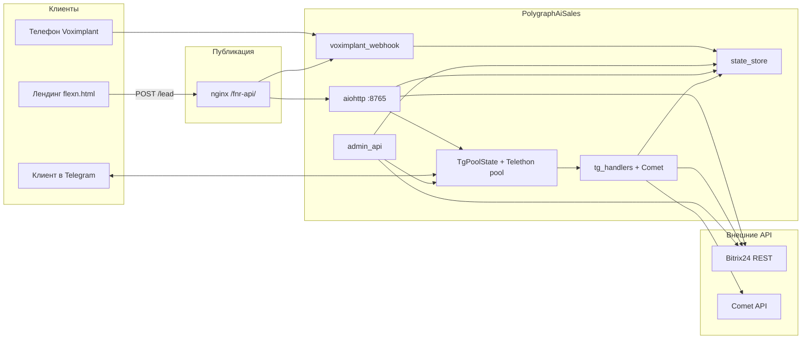

# Архитектура PolygraphAiSales (fnr-api)

## Назначение системы

| Компонент | Роль |
|-----------|------|
| **HTTP-сервис (aiohttp)** | `POST /lead`, админка `/admin/*`, `/team-accounts`, вебхук Voximplant, health |
| **Пул Telethon** | Несколько пользовательских аккаунтов Telegram; исходящие приветствия и входящие диалоги |
| **Comet API** | Генерация ответов, транскрипция/vision при необходимости |
| **Bitrix24** | Лиды, сделки, стадии, ответственные, таймлайн, комментарии |
| **Статика** | Лендинг `flexn.html`, админка `admin/`, общие `assets/` |

## Диаграмма потоков (высокий уровень)

## Структура каталогов

| Путь | Описание |
|------|----------|
| **`app/`** | Прикладной код: `main.py` (точка входа HTTP, middleware готовности Telethon, `/lead`), `admin_api.py`, `tg_handlers.py`, `tg_pool.py`, `state_store.py`, `bitrix.py`, `comet_client.py`, `comet_media.py`, `manager_router.py`, `sales_sync.py`, `voximplant_webhook.py`, `telegram_profiles.py`, вспомогательные модули |
| **`admin/`** | Админ-интерфейс: список чатов, переписка, отправка, синхронизация sales, Bitrix ping/resync, журнал звонков |
| **`assets/`** | Общие `css` / `js` для админки и демо |
| **`data/`** | **`fnr_state.json`** — отслеживаемые uid, истории диалогов, `bitrix_uid_meta`, round-robin, **`voice_calls`**. **`fnr_sales_sync.json`** — люди, роли, активность, очередь лидов (не в git на проде) |
| **`sessions/`** | Файлы `*.session` Telethon (не в git) |
| **`voximplant/`** | Сценарии VoxEngine (JS), тексты промптов, инструкции по handoff и вебхуку |
| **`tests/`** | Модульные тесты (`unittest`) |
| **`docs/`** | Архитектура, quickstart, описание продукта |
| **`flexn.html`**, **`privacy.html`**, **`logo.svg`** | Публичные страницы |
| **`accounts_registry.json`** | Реестр Telegram-аккаунтов (шаблон: `accounts_registry.json.example`) |
| **`accounts_registry.py`** | Чтение реестра, список аккаунтов для админки |
| **`restart.sh`**, **`deploy.sh`** | Перезапуск процесса; git pull + pip + копирование статики + restart |
| **`check_session.py`** | Утилита проверки сессии (при необходимости) |
| **`ai_messaging/`** | Общая обвязка Telethon-клиента для аккаунта |

Поток с сайта: **браузер** → **nginx** `/fnr-api/` → **процесс на 127.0.0.1** → при необходимости **Bitrix**, **Telegram**.

## Жизненный цикл процесса

1. **`create_app()`** регистрирует middleware, маршруты, `on_startup` / `on_cleanup`.
2. **`on_startup`** создаёт **`TgPoolState`**, грузит state и persisted profiles, запускает **фоновую** задачу подключения Telethon — HTTP-порт открывается без ожидания всех сессий (избегание 502 у nginx).
3. Пока `pool.ready === false`, middleware отвечает **`503 warming_up`** на защищённые маршруты; **`/health`** и вебхук Voximplant доступны.
4. **`on_cleanup`** отключает клиентов Telethon.

## Распределение лидов и роли

- Новый uid при **`POST /lead`** (канал Telegram): **`pick_account_for_new_lead`** — round-robin среди **`eligible_active_account_ids`** / **`lead_eligible_account_ids`** (см. `sales_sync.py`, список из админки).
- Повторный uid: **`resolve_account_for_lead_dialog`** — тот же аккаунт, с логикой отпуска/переназначения.
- Маркеры в ответе ИИ: **`[[FNR_EVENT:...]]`**, **`[[FNR_ROUTE:...]]`** → обновление сделки в Bitrix (**`apply_deal_outcome`**, стадии и ответственный).

Подробнее о полях state — **`app/state_store.py`**.

## Переменные окружения

Сводная таблица в **`README.md`** и расширенные комментарии в **`.env.example`**.

## Расширение системы

| Задача | Куда смотреть |
|--------|----------------|
| Новый HTTP endpoint | `app/main.py` или `app/admin_api.py` → `setup_*_routes` |
| Правила CRM | `app/bitrix.py`, переменные `.env` |
| Поведение бота в личке | `app/tg_handlers.py`, `app/comet_client.py` |
| Новый тип события телефонии | `app/voximplant_webhook.py`, формат в `voximplant/VOICE_CALLS_WEBHOOK.md` |
| UI админки | `admin/index.html`, `assets/css/admin.css`, `assets/js/*` |

---

*Согласовано с кодом в репозитории; при изменении потоков обновите диаграмму и таблицы.*
